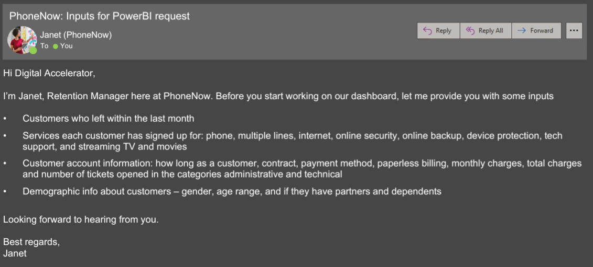
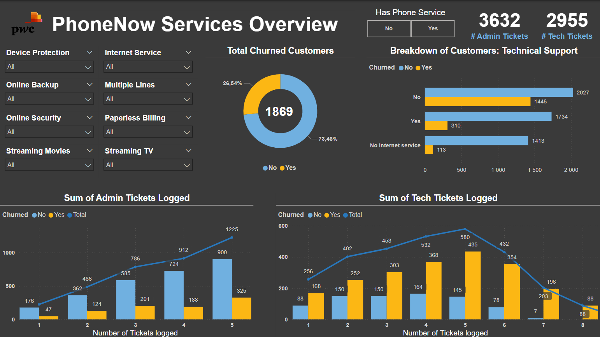
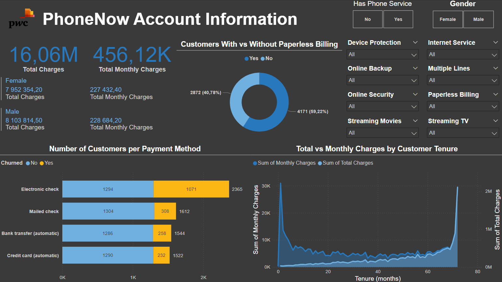
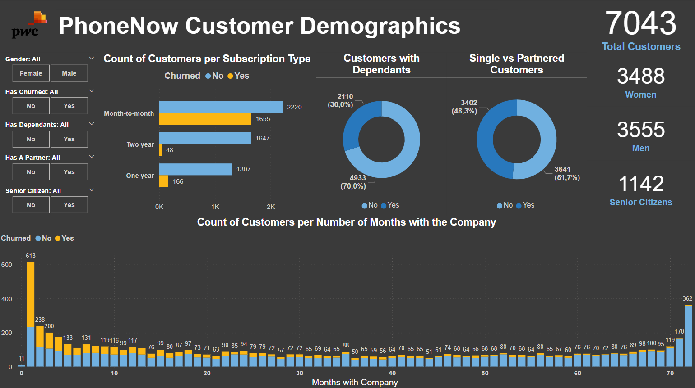

# CustomerChurn
This project is part of a 3-part Job Simulation offered by PwC Switzerland through Forage.

## Problem Statement and Brief:
The retention manager of PhoneNow(A Telecom company) has reached out seeking insights into the services, accounts and customers of the company and has provided the data:

The task is to create a dashboard in Power BI for the reflects all relevant Key Performance Indicators (KPIs) and metrics in the dataset 

## Analysis and Insights:
### Key Findings:
- 77.4% of churned customers do not have technical support, which makes it a significant factor in customer retention.
- Churned customers log 2.5 times more technical tickets, with the majority logging between 4 and 6 tickets.
- Customers using electronic checks churn the most, with this group exceeding all other payment methods combined.
- 40% of customers still use paper billing methods, specifically mailed checks.
- 88.5% of churned customers are on a month-to-month subscription.
- Customers with dependents churn at a higher rate, with 82.6% observed of all churned customers.

### Recommendations:
- Implement a proactive technical support outreach program targeting customers without support. Offer free or discounted trials for tech support services to show the value and reduce churn rates.
- Introduce a ticket prioritization system that flags high-frequency ticket loggers (i.e. those logging over 4 tickets) as high-risk for churn. Provide them with dedicated support and faster resolution times.
- Investigate the user experience associated with electronic checks—this could be indicative of a cumbersome payment process or delays. Encourage automated or credit card payments through incentives, such as discounts or loyalty rewards for switching.
- Transition more customers to paperless billing with clear, easy-to-follow steps and incentives like discounts or faster billing processing. Highlight environmental benefits and ease of access to attract more customers to switch.
- Offer incentives for longer-term commitments, such as discounts for signing a 6-month or yearly contract. Ensure that month-to-month customers are engaged through personalized offers and reminders to renew.
- Consider targeted promotions or family plan options that could add value for customers with dependants. Provide additional features or services that cater to families, such as family bundles or shared benefits.

## Skills:
Data Visualisation, PowerBI, DAX, Data Analysis

